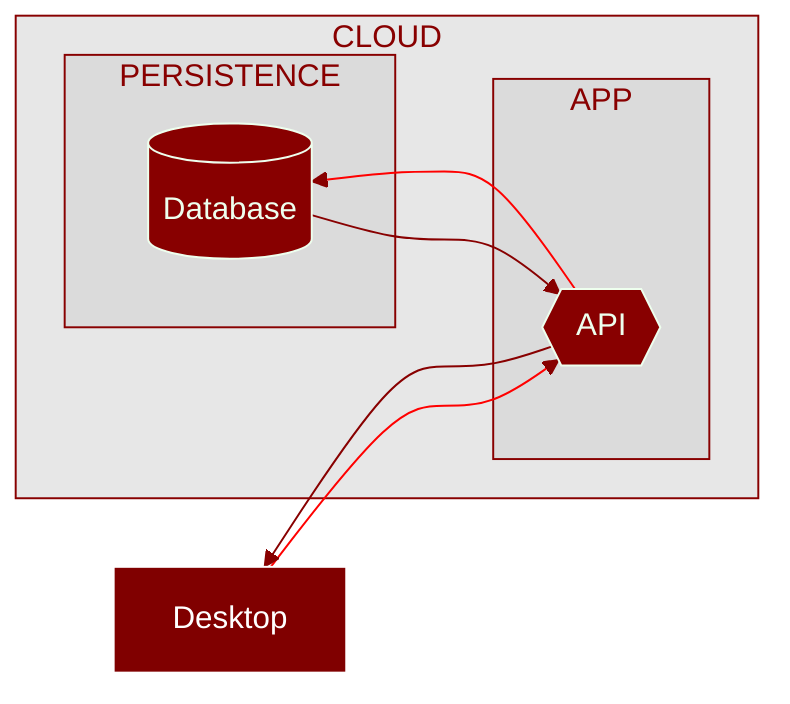

<h1 align="center">
   
  BOOKERY
</h1>

Built on Axum and Tauri, Rust frameworks for API and Desktop, respectively, Bookery is a mini desktop system for libraries to manage their books and loans.

Bookery allows you to efficiently register and search for authors, books, customers and rentals, offering a complete management experience with advanced filters, editing options and an intuitive interface. Each feature has been designed to ensure that libraries can manage their collections and transactions quickly and accurately.

Developed with a rigorous focus on quality, the system is evaluated by more than 140 automated tests, guaranteeing robustness and reliability. Taking advantage of Rust's efficiency, Bookery outperforms solutions such as Electron in terms of processing and memory usage, while the Axum API provides performance perfectly comparable to C/C++, offering high performance with simplicity and efficiency.

## Stack

## Arch

The architecture can be broadly broken down into two fronts: Desktop and API. Treating the Desktop application as the client of this solution, a behavioral view will be detailed on a “macro” scale, following the flow of data without focusing on the “micro”, such as each action of each function. Follow the general flow of information below:

## Details

For organizational reasons, in order to maintain consistency in the Bookery documentation, the details of each side of the system are described within their own modules. Consider visiting the addresses below to view the details of each module's architecture:

- [Arquitetura Desktop](https://github.com/LucasGoncSilva/bookery/tree/main/BOOKERY/desktop) - Client of the solution, part that runs on the user's machine
- [Arquitetura API](https://github.com/LucasGoncSilva/bookery/tree/main/BOOKERY/api) - Solution server, side maintained in the cloud
- [Arquitetura Compartilhada](https://github.com/LucasGoncSilva/bookery/tree/main/BOOKERY/shared) - Hub for shared structures between the aforementioned modules

## License

This project is under [MPLv2 - Mozilla Public License Version 2.0](https://choosealicense.com/licenses/mpl-2.0/). Permissions of this weak copyleft license are conditioned on making available source code of licensed files and modifications of those files under the same license (or in certain cases, one of the GNU licenses). Copyright and license notices must be preserved. Contributors provide an express grant of patent rights. However, a larger work using the licensed work may be distributed under different terms and without source code for files added in the larger work.
