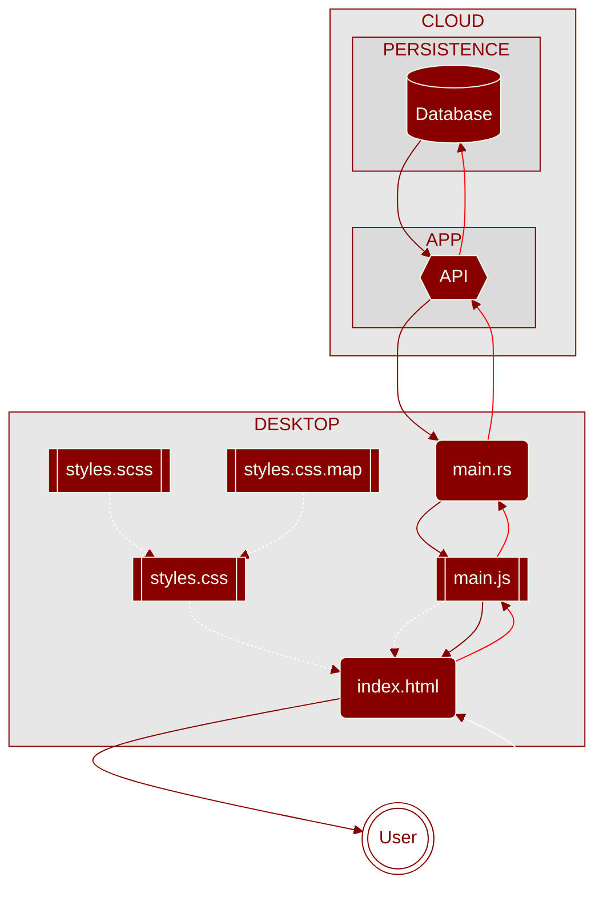

<h1 align="center">BOOKERY - Desktop</h1>


Running on the client side, literally, the Desktop is responsible for direct communication with the system's end user. It is the contact channel between the system operator and all the information the system presents.

Its file structure reflects its processing structure, its routes and interactions with the database. Each directory has files whose name defines which `struct' - the database model - this file deals with within the logic defined by its directory.

## Stack


## Arch

The Bookery Desktop presents the standard architecture of a Tauri project, defined by the Framework itself. In practical terms, you can see the following structure:

```bash
.
├── docs                                      # Documentation directory
│   ├── README.md                             # Main read-only file
│   └── ...                                   # Other files useful for documentation
│
├── package.json                              # Dependency management file
├── package-lock.json                         # Dependency management file
│
├── src                                       # User interfaces source code directory
│   ├── index.html                            # Interface input file
│   ├── main.js                               # Main JavaScript behavior file
│   ├── styles.css                            # Self-generated and compressed styles file for optimization
│   ├── styles.css.map                        # Config and organization file for the above file
│   └── styles.scss                           # File of defined styles
│
└── src-tauri                                 # Compiler/bundle source code directory
    ├── build.rs                              # Build config file
    │
    ├── Cargo.toml                            # Project dependencies file
    │
    ├── icons                                 # Application icons directory
    │   ├── *.icns                            # Icon files in .icns format
    │   ├── *.ico                             # Icon files in .ico format
    │   └── *.png                             # Icon files in .png format
    │
    ├── tauri.conf.json                       # Build help and configuration file
    │
    └── src                                   # Engine source code directory
        └── main.rs                           # Back-end executable input file
```

**NOTE: Just to inform you that there is no `struct` directory or file listed above because the `Author`, `Book`, `Costumer` and `Rental` structures have been defined within the workspace in the directory named `shared`. This arrangement is due to the fact that the structures mentioned above are shared between the two fronts of the project, used both on the Desktop and in the API.**

The Desktop architecture seen in detail, with the API as the server which, in turn, accesses the Database as needed; still on a macro scale but looking in more detail at the Front-end of the application, we then have the following situation:


```mermaid
flowchart TB


subgraph CLOUD
    subgraph PERSISTENCE
        Database[(Database)]:::Arch
    end

    subgraph APP
        API{{API}}:::Arch
    end
end

subgraph DESKTOP
    HTML(index.html):::Arch

    CSS[[styles.css]]:::Arch
    SCSS[[styles.scss]]:::Arch
    CSSMAP[[styles.css.map]]:::Arch

    JS[[main.js]]:::Arch

    RS(main.rs):::Arch
end

User(((User)))


SCSS & CSSMAP -.-> CSS
JS & CSS -.-> HTML

User --> HTML --> JS --> RS

RS ~~~ API
RS --> API
API --> Database
Database --> API
Database ~~~ API
Database ~~~ API
API --> RS

RS --> JS --> HTML --> User


style CLOUD fill:#ccc7,color:#800,stroke:#800;
style APP fill:#ccc7,color:#800,stroke:#800;
style PERSISTENCE fill:#ccc7,color:#800,stroke:#800;
style DESKTOP fill:#ccc7,color:#800,stroke:#800;

style User fill:#fff,color:#800,stroke:#800;

classDef Arch fill:#800,color:#efe,stroke:#efe;

linkStyle 0,1,2,3,4 stroke:#fff
linkStyle 5,6,7,8,9 stroke:#f00
linkStyle default stroke:#800
```

The above flow takes place - on the Desktop - all grouped together, compiled and generated in a single executable bundle (`.exe` on Windows, `.app` on MacOS, AppImage on Linux), so it's all “one thing” - in quotes. Although it is all one thing, internally the responsibilities and logical order is established as shown in the diagram above.

## Basic

Before starting with development and commands, it is important to define the environment variables in your development environment. Below is a list of which ones to set:

| Name      |  Type  | Mandatory  | Default | Description             |
| :-------- | :----: | :--------: | :-----: | ----------------------- |
| `API_URL` | `&str` | `Required` | `None`  | API's string connection |

### Run Local Server

`npm run tauri dev`

### Build Bundle

`npm run tauri build`

## JS vs Rust

In the closed mini ecosystem called Bookery, some administrative tasks can only be carried out by JavaScript, others only by Rust, but some of them could be carried out by both. Here, the responsibilities of each language for a given type of task are highlighted and defined in more detail, along with the justification for each choice.

### JavaScript

The tasks that JS is solely responsible for are those that interact and have a direct impact on the interface in contact with the user. Just like on a web page, JavaScript takes on the same tasks here as it would there.

Button behavior, element manipulation, text alteration - these are the responsibilities of the “duck”, as some call the brain of HTML.

### Rust

For practical reasons, Rust takes on the responsibility of communicating with the API, processing requests and responses to the API and the user, respectively. The practicality comes precisely from the structure shared by both fronts, where the structs `Author`, `Book`, `Costumer` and `Rental`, created in Rust, can be reused.

### Both

Issues such as data cleaning/processing, HTML assembly, element counting and component rendering could be the responsibility of either side, they are both excellent in these matters, but different and it is precisely these differences that have determined which side manages which issue.

Javascript is extremely practical, simple to read, easy to write, straightforward in its approach, like a car dashboard. Because it's so easy in these situations, it takes on tasks such as data processing and component rendering.

Rust is extremely detailed, intriguing to read, complex to write, regimented with its approaches, like an airplane dashboard. Although it's more verbose and rigid, its processing speed and security are perfect for handling heavier tasks, such as counting extremely long elements and processing + assembling heavy, loaded HTML bodies.
