<h1 align="center">
   
  BOOKERY
</h1>

Criado em Axum e Tauti, Frameworks Rust para API e Desktop, respectivamente, Bookery é um mini-sistema desktop para bibliotecas realizarem o gerenciamento de seus livros e empréstimos.
  
O Bookery permite o cadastro e a busca eficiente de autores, livros, clientes e aluguéis, oferecendo uma experiência completa de gerenciamento com filtros avançados, opções de edição e uma interface intuitiva. Cada funcionalidade foi projetada para garantir que bibliotecas possam administrar suas coleções e transações de maneira ágil e precisa.
  
Desenvolvido com um foco rigoroso em qualidade, o sistema é avaliado por mais de 140 testes automatizados, garantindo robustez e confiabilidade. Aproveitando a eficiência do Rust, o Bookery supera soluções como o Electron em termos de processamento e uso de memória, enquanto a API em Axum proporciona uma performance comparável a C/C++, oferecendo um desempenho superior com simplicidade e eficácia.

 

## Stack

 

## Arquitetura

A arquitetura pode ser detalhada de forma geral em duas frentes: Desktop e API. Tratando a aplicação Desktop como cliente desta solução, será detalhada uma visão comportamental em escala "macro" seguindo o fluxo de dados sem focar no "micro", como cada ação de cada função. Acompanhe abaixo o fluxo geral de informações:

 

## Observação

Os detalhes de cada face do sistema estão descritos dentro de seus próprios módulos. Considere acessar os endereços abaixo para visualizar os detalhes da arquitetura de cada módulo:

- [Arquitetura Desktop](https://github.com/LucasGoncSilva/bookery/tree/main/BOOKERY/desktop)
- [Arquitetura API](https://github.com/LucasGoncSilva/bookery/tree/main/BOOKERY/api)
- [Arquitetura Compartilhada](https://github.com/LucasGoncSilva/bookery/tree/main/BOOKERY/shared)

 

## Licença

This project is under [MPLv2 - Mozilla Public License Version 2.0](https://choosealicense.com/licenses/mpl-2.0/). Permissions of this weak copyleft license are conditioned on making available source code of licensed files and modifications of those files under the same license (or in certain cases, one of the GNU licenses). Copyright and license notices must be preserved. Contributors provide an express grant of patent rights. However, a larger work using the licensed work may be distributed under different terms and without source code for files added in the larger work.
